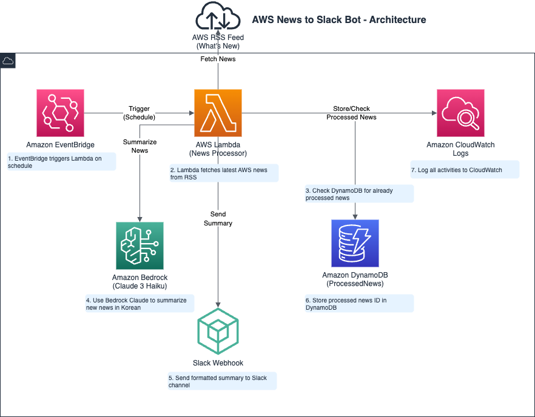

# AWS News to Slack Bot

AWS의 최신 뉴스를 자동으로 수집하여 한국어로 요약한 후 Slack으로 전송하는 Lambda 함수입니다.

## 🚀 주요 기능

- **자동 뉴스 수집**: AWS RSS 피드에서 최신 뉴스를 자동으로 가져옵니다
- **AI 요약**: Amazon Bedrock Claude 모델을 사용하여 뉴스를 한국어로 요약합니다
- **중복 방지**: DynamoDB를 사용하여 이미 처리된 뉴스는 건너뜁니다
- **Slack 알림**: 요약된 뉴스를 Slack 채널로 자동 전송합니다
- **초기 실행 처리**: 첫 실행 시에는 알림 없이 기록만 수행합니다

## 🏗️ 아키텍처



이 시스템은 다음 AWS 서비스들을 사용합니다:

- **AWS Lambda**: 메인 처리 로직 실행
- **Amazon DynamoDB**: 처리된 뉴스 기록 저장
- **Amazon Bedrock**: AI 기반 뉴스 요약 생성
- **Amazon EventBridge**: 정기적인 실행 스케줄링 (선택사항)

### 처리 흐름

1. **EventBridge**가 설정된 스케줄에 따라 Lambda 함수를 트리거합니다
2. **Lambda 함수**가 AWS RSS 피드에서 최신 뉴스를 가져옵니다
3. **DynamoDB**에서 이미 처리된 뉴스인지 확인합니다
4. 새로운 뉴스에 대해 **Bedrock Claude**를 사용하여 한국어로 요약합니다
5. 요약된 내용을 **Slack**으로 전송합니다
6. 처리된 뉴스 ID를 **DynamoDB**에 저장하여 중복 처리를 방지합니다
7. 모든 활동은 **CloudWatch Logs**에 기록됩니다

## 📋 사전 요구사항

### AWS 리소스
- DynamoDB 테이블: `ProcessedNews` (파티션 키: `id`)
- Bedrock 모델 액세스: `anthropic.claude-3-haiku-20240307-v1:0`
- Lambda 실행 역할에 다음 권한 필요:
  - DynamoDB 읽기/쓰기 권한
  - Bedrock 모델 호출 권한

### 환경 변수

#### 필수 환경 변수
```bash
SLACK_WEBHOOK=https://hooks.slack.com/services/YOUR/SLACK/WEBHOOK
AWS_REGION=ap-northeast-2                    # AWS 리전
DYNAMODB_TABLE=ProcessedNews                 # DynamoDB 테이블명
BEDROCK_MODEL_ID=anthropic.claude-3-haiku-20240307-v1:0  # Bedrock 모델 ID
```

#### 선택적 환경 변수 (기본값 제공)
```bash
# 성능 및 제한 설정
MAX_RETRIES=3                               # 최대 재시도 횟수 (기본값: 3)
RETRY_DELAY_BASE=2                          # 재시도 딜레이 기본값 (기본값: 2초)
MAX_SLACK_LENGTH=3900                       # Slack 메시지 최대 길이 (기본값: 3900)
CONTENT_MAX_LENGTH=3000                     # 본문 최대 길이 (기본값: 3000)
REQUEST_TIMEOUT=10                          # HTTP 요청 타임아웃 (기본값: 10초)
PROCESSING_DELAY=12                         # 뉴스 처리 간 딜레이 (기본값: 12초)
```

#### RSS 피드 설정
RSS 피드 URL은 AWS 공식 뉴스 피드로 하드코딩되어 있습니다:
```
https://aws.amazon.com/about-aws/whats-new/recent/feed/
```

## 🛠️ 설치 및 배포

이 프로젝트는 여러 가지 방법으로 배포할 수 있습니다:

### 방법 1: 자동 배포 스크립트 사용 (권장)

가장 간단한 배포 방법입니다. `deploy.sh` 스크립트가 모든 과정을 자동화합니다.

```bash
# 기본 배포
./deploy.sh aws-news-to-slack https://hooks.slack.com/services/YOUR/SLACK/WEBHOOK

# 커스텀 설정으로 배포
AWS_REGION_OVERRIDE=us-east-1 \
PROCESSING_DELAY_OVERRIDE=15 \
./deploy.sh my-function https://hooks.slack.com/services/YOUR/SLACK/WEBHOOK
```

**deploy.sh 스크립트 기능:**
- Python 의존성 자동 설치
- Lambda 함수 생성/업데이트
- 환경 변수 설정
- DynamoDB 테이블 자동 생성
- 배포 패키지 생성 및 정리

**환경 변수 커스터마이징:**
- `AWS_REGION_OVERRIDE`: AWS 리전 변경 (기본: ap-northeast-2)
- `DYNAMODB_TABLE_OVERRIDE`: DynamoDB 테이블명 변경 (기본: ProcessedNews)
- `BEDROCK_MODEL_ID_OVERRIDE`: Bedrock 모델 ID 변경
- `MAX_RETRIES_OVERRIDE`: 최대 재시도 횟수 변경
- `PROCESSING_DELAY_OVERRIDE`: 처리 딜레이 변경

### 방법 2: CloudFormation 사용

인프라를 코드로 관리하고 싶다면 CloudFormation을 사용하세요.

```bash
# CloudFormation 스택 생성
aws cloudformation create-stack \
  --stack-name aws-news-to-slack \
  --template-body file://cloudformation-template.yaml \
  --parameters ParameterKey=SlackWebhookUrl,ParameterValue=https://hooks.slack.com/services/YOUR/SLACK/WEBHOOK \
  --capabilities CAPABILITY_NAMED_IAM

# 스택 업데이트
aws cloudformation update-stack \
  --stack-name aws-news-to-slack \
  --template-body file://cloudformation-template.yaml \
  --parameters ParameterKey=SlackWebhookUrl,ParameterValue=https://hooks.slack.com/services/YOUR/SLACK/WEBHOOK \
  --capabilities CAPABILITY_NAMED_IAM
```

### 방법 3: GitHub Actions CI/CD

GitHub에서 자동 배포를 설정할 수 있습니다.

**필요한 GitHub Secrets:**
```
AWS_ACCESS_KEY_ID          # AWS 액세스 키
AWS_SECRET_ACCESS_KEY      # AWS 시크릿 키
SLACK_WEBHOOK_PROD         # Production Slack Webhook
SLACK_WEBHOOK_DEV          # Development Slack Webhook
```

**배포 방법:**
- `main` 브랜치에 push하면 자동으로 Production 환경에 배포
- GitHub Actions에서 "Run workflow"로 수동 배포 가능

### 방법 4: 수동 배포

직접 AWS CLI를 사용한 수동 배포:

#### 4.1. 의존성 설치
```bash
pip install -r requirements.txt -t .
```

#### 4.2. Lambda 함수 생성
```bash
# ZIP 파일 생성
zip -r aws-news-slack.zip . -x "*.git*" "*.md" "*.drawio" "*.sh" "__pycache__/*" "*.pyc"

# AWS CLI를 사용한 Lambda 함수 생성
aws lambda create-function \
  --function-name aws-news-to-slack \
  --runtime python3.9 \
  --role arn:aws:iam::YOUR-ACCOUNT:role/lambda-execution-role \
  --handler lambda_function.lambda_handler \
  --zip-file fileb://aws-news-slack.zip \
  --timeout 300 \
  --memory-size 512
```

#### 4.3. 환경 변수 설정
```bash
aws lambda update-function-configuration \
  --function-name aws-news-to-slack \
  --environment Variables='{SLACK_WEBHOOK=https://hooks.slack.com/services/YOUR/SLACK/WEBHOOK,AWS_REGION=ap-northeast-2,DYNAMODB_TABLE=ProcessedNews,BEDROCK_MODEL_ID=anthropic.claude-3-haiku-20240307-v1:0}'
```

#### 4.4. DynamoDB 테이블 생성
```bash
aws dynamodb create-table \
  --table-name ProcessedNews \
  --attribute-definitions AttributeName=id,AttributeType=S \
  --key-schema AttributeName=id,KeyType=HASH \
  --billing-mode PAY_PER_REQUEST \
  --region ap-northeast-2
```

## 📦 Python 패키지 정보

이 프로젝트는 표준 Python 패키지 구조를 따릅니다:

- **setup.py**: 패키지 메타데이터 및 의존성 정보
- **requirements.txt**: 런타임 의존성 목록
- **test_lambda_function.py**: 단위 테스트

패키지 정보 확인:
```bash
python setup.py --name --version --description
```

## ⚙️ 설정

### Lambda 함수 설정
- **런타임**: Python 3.9
- **메모리**: 512MB
- **타임아웃**: 5분 (300초)
- **리전**: ap-northeast-2 (서울)

### 정기 실행 설정 (선택사항)
EventBridge를 사용하여 정기적으로 실행하도록 설정할 수 있습니다:

```bash
# 매일 오전 9시에 실행하는 규칙 생성
aws events put-rule \
  --name aws-news-daily \
  --schedule-expression "cron(0 0 * * ? *)"

# Lambda 함수를 타겟으로 추가
aws events put-targets \
  --rule aws-news-daily \
  --targets "Id"="1","Arn"="arn:aws:lambda:ap-northeast-2:YOUR-ACCOUNT:function:aws-news-to-slack"
```

## 📊 모니터링

### CloudWatch 로그
Lambda 함수의 실행 로그는 CloudWatch Logs에서 확인할 수 있습니다:
- 로그 그룹: `/aws/lambda/aws-news-to-slack`

### 주요 로그 메시지
- `[INFO]`: 정상 처리 정보
- `[WARN]`: 경고 (본문 추출 실패 등)
- `[ERROR]`: 오류 발생

## 🔧 문제 해결

### 일반적인 문제들

1. **Bedrock ThrottlingException**
   - 요청 간 12초 딜레이가 설정되어 있습니다
   - 필요시 `RETRY_DELAY_BASE` 값을 조정하세요

2. **DynamoDB 권한 오류**
   - Lambda 실행 역할에 DynamoDB 권한이 있는지 확인하세요

3. **Slack 전송 실패**
   - Webhook URL이 올바른지 확인하세요
   - 메시지 길이가 3900자를 초과하지 않는지 확인하세요

## 📝 라이선스

이 프로젝트는 MIT 라이선스 하에 배포됩니다.

## 🤝 기여

버그 리포트나 기능 제안은 GitHub Issues를 통해 제출해 주세요.